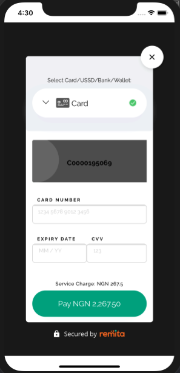

# Remita Flutter Inline Payment

---
- [Overview](#Overview)
- [Installation](#Installation)
- [Usage](#Usage)
- [Contributing](#Contributing)

---
## Overview

Remita Flutter Inline Payment is a Remita package that helps you accept payment in your flutter application.




## Installation

1. Add the dependency to your project. In your `pubspec.yaml` file add: `remita_flutter_inline: 1.0.3`
2. Run `flutter pub get`


### Requirements

1. Remita [API Keys](https://api.remita.net/#63394d54-96c1-4dd8-8255-51e9a55e16df)
2. Supported Flutter version >= 1.17.0


## Usage

### Initializing a RemitaPayment instance

To create an instance, you should call the RemitaInlinePayment constructor with the following as parameters:

-  `BuildContext`
-  `PaymentRequest`
-  `Customizer`


It returns an instance of RemitaInlinePayment
with this instance, we then call the async method `.initiatePayment()`.

    _handlePayment() async { 

        PaymentRequest request = PaymentRequest(
            environment: RemitaEnvironment.demo,
            rrr: 'pass your rrr here',
            key: 'enter your key here',
        );

        RemitaPayment remita = RemitaInlinePayment(
            buildContext: context,
            paymentRequest: request,
            customizer: Customizer(),
        );

        PaymentResponse response = await remita.initiatePayment();
    }


### Handling the response

Calling `.initiatePayment()` method returns a Future of `PaymentResponse`.


    PaymentResponse response = await remita.initiatePayment();
    if (response.code != null && response.code == '00') {
      // transaction successful
      // verify transaction status before providing value
    } else {
      
    }


###  TEST CARDS


```json
    CARD: 5178 6810 0000 0002,  
    Expire Date : 05/30,  
    CCV: 000, 
    OTP: 123456
```


## Contributing
- To contribute to this repo, follow these guidelines for creating issues, proposing new features, and submitting pull requests:

Fork the repository.
1. Create a new branch: `git checkout -b "feature-name"`
2. Make your changes and commit: `git commit -m "added some new features"`
3. Push your changes: `git push origin feature-name`
4. Submit a Pull Request (PR).

### Useful links
* Join our [Slack](http://bit.ly/RemitaDevSlack) Developer/Support channel
    
### Support
- For all other support needs, support@remita.net 
## License

By contributing to the Flutter library, you agree that your contributions will be licensed under its [MIT license](/LICENSE).


## Built Using

- [flutter](https://flutter.dev/)
- [flutter_inappwebview](https://pub.dev/packages/flutter_inappwebview)
